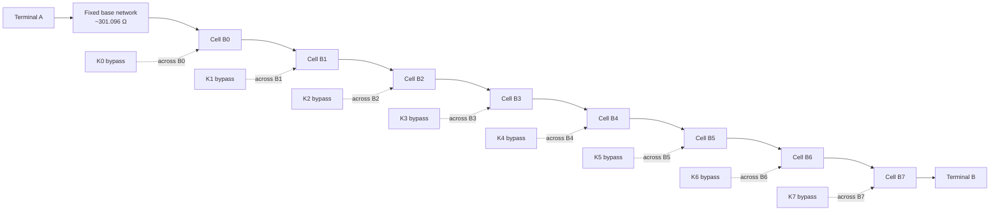
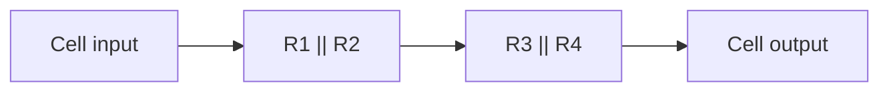

# E-Resistor 8-Relay Programmable Resistor
## Hardware and Python Driver Specification

**Purpose:** This document defines the electrical topology, bit mapping, resistor-cell values,
valid combinations, code-to-resistance calculation, and relay-control rules for an 8-relay
programmable resistor board.

It is written as an implementation specification for an AI coding agent (for example Claude)
to create a Python driver without having to infer the hardware behavior.

---

## 1. Design goals

The current design provides:

- 8 binary-controlled resistor cells.
- 256 electrically valid relay combinations.
- Codes **0 through 189** are the intended application range.
- 190 approximately linearly distributed operating points.
- Nominal range of approximately **301 Ω to 400.34 kΩ** for codes 0...189.
- Full electrical range up to approximately **540.48 kΩ** for code 255.
- Only resistor values from the existing project inventory are used.
- Each relay cell has four resistor footprints.
- Each cell is made from **two parallel resistor groups connected in series**.
- A relay contact bypasses the entire resistor cell.

The nominal resistance is calculated from the actual synthesized cell values, not from ideal
binary values.

---

## 2. Overall electrical topology



Equivalent conceptual circuit:

```text
Terminal A
   |
 [BASE]
   |
   +---[ CELL B0 ]---[ CELL B1 ]---[ CELL B2 ]--- ... ---[ CELL B7 ]--- Terminal B
   |        |              |              |                         |
   |       K0             K1             K2                        K7
   |   bypass contact  bypass contact  bypass contact           bypass contact
   |
```

Each relay bypass contact is wired **across the complete cell**.

### Relay behavior

Recommended wiring uses the relay **NO (normally open)** contact as the bypass:

- **Relay coil OFF:** NO contact open -> resistor cell is inserted.
- **Relay coil ON:** NO contact closed -> resistor cell is bypassed.

This provides a useful fail-safe condition: if relay power is lost, all cells become inserted
and the output resistance becomes high rather than unexpectedly low.

---

## 3. One resistor cell

Every bit cell contains four resistor positions:



Mathematically:

```text
Rcell = (R1 || R2) + (R3 || R4)
```

where:

```text
Ra || Rb = (Ra * Rb) / (Ra + Rb)
```

Population rules:

- Both footprints populated -> normal parallel pair.
- One footprint DNP -> the other resistor alone defines that pair.
- `0 Ω || DNP` -> pair resistance is 0 Ω.
- DNP must be represented as an open circuit, not as zero resistance.
- A 0 Ω resistor in parallel with another resistor forces that pair to approximately 0 Ω.

---

## 4. Fixed base network

The base network is always in the signal path.

Population:

```text
698 Ω || 698 Ω || 2.74 kΩ || 11 kΩ
```

Nominal calculated value:

```text
RBASE = 301.095798 Ω
```

Use this value in nominal calculations unless calibration data overrides it.

---

## 5. Bit / resistor population table

| Bit | Bit index | Bit mask | R1 | R2 | R3 | R4 | Nominal cell resistance |
|---|---:|---:|---:|---:|---:|---:|---:|
| B0 | 0 | `0x01` | 953 Ω | 2.74 kΩ | 2.74 kΩ | 2.74 kΩ | 2,077.073 Ω |
| B1 | 1 | `0x02` | 2.74 kΩ | 8.25 kΩ | 2.74 kΩ | 11 kΩ | 4,250.465 Ω |
| B2 | 2 | `0x04` | 0 Ω | DNP | 11 kΩ | 36.5 kΩ | 8,452.632 Ω |
| B3 | 3 | `0x08` | 11 kΩ | 36.5 kΩ | 11 kΩ | 36.5 kΩ | 16,905.263 Ω |
| B4 | 4 | `0x10` | 2.74 kΩ | 36.5 kΩ | 36.5 kΩ | 226 kΩ | 33,973.437 Ω |
| B5 | 5 | `0x20` | 36.5 kΩ | 226 kΩ | 36.5 kΩ | DNP | 67,924.762 Ω |
| B6 | 6 | `0x40` | 8.25 kΩ | 8.25 kΩ | 226 kΩ | 316 kΩ | 135,888.838 Ω |
| B7 | 7 | `0x80` | 2.74 kΩ | 226 kΩ | 536 kΩ | 536 kΩ | 270,707.178 Ω |

The nominal cell-weight array for software is:

```python
CELL_WEIGHTS_OHM = [
    2077.072840509,   # B0
    4250.465223778,   # B1
    8452.631578947,   # B2
    16905.263157895,  # B3
    33973.436726373,  # B4
    67924.761904762,  # B5
    135888.837638376, # B6
    270707.178455889, # B7
]

BASE_RESISTANCE_OHM = 301.095798342
```

---

## 6. Logical bit definition

**This distinction is important for the Python driver.**

The public/software code uses:

```text
logical bit = 1  -> resistor cell INSERTED
logical bit = 0  -> resistor cell BYPASSED
```

Therefore:

```text
code bit B0 controls cell B0
code bit B1 controls cell B1
...
code bit B7 controls cell B7
```

The software resistance equation is:

```text
R(code) = RBASE + B0*R0 + B1*R1 + ... + B7*R7
```

where each `Bn` is either 0 or 1.

Equivalent Python:

```python
def nominal_resistance(code: int) -> float:
    if not 0 <= code <= 0xFF:
        raise ValueError("code must be 0..255")

    resistance = BASE_RESISTANCE_OHM

    for bit, weight in enumerate(CELL_WEIGHTS_OHM):
        if code & (1 << bit):
            resistance += weight

    return resistance
```

---

## 7. Logical code versus physical relay coil mask

Because the NO contact is used as the bypass:

| Logical resistance bit | Cell state | Relay coil | NO bypass |
|---:|---|---|---|
| 0 | Bypassed | ON | Closed |
| 1 | Inserted | OFF | Open |

Therefore, if the relay-driver output uses:

```text
1 = energize relay coil
0 = relay coil off
```

then the physical coil mask is the inverse of the resistance code:

```python
coil_mask = (~code) & 0xFF
```

Examples:

```text
Resistance code 0x00 -> coil mask 0xFF
Resistance code 0xFF -> coil mask 0x00
Resistance code 0xBD -> coil mask 0x42
```

### Do not hide this inversion inside multiple layers

The recommended software architecture is:

```text
requested resistance
       |
       v
 nearest logical code
       |
       v
 logical resistance code       <-- 1 = resistor inserted
       |
       v
 relay mapping/inversion
       |
       v
 physical coil mask             <-- 1 = coil energized
       |
       v
 hardware transport
```

This makes debugging substantially easier.

---

## 8. Available combinations

With 8 independent bits:

```text
Total combinations = 2^8 = 256
```

All codes from:

```text
0x00 ... 0xFF
```

are electrically valid.

### Application range

For the intended approximately 300 Ω to 400 kΩ application:

```text
VALID_MIN_CODE = 0
VALID_MAX_CODE = 189       # 0xBD
VALID_POINT_COUNT = 190
```

Codes 190...255 are electrically valid, but their nominal resistance exceeds the requested
400 kΩ range.

### Nominal endpoints

Code `0x00`:

```text
R = 301.095798 Ω
```

Code `0xBD` (189):

```text
R = 400341.440463 Ω
```

Code `0xFF` (255):

```text
R = 540480.743325 Ω
```

---

## 9. Why binary code order is monotonic

The resistor cells were synthesized so that every higher bit has a value greater than the
sum of all lower bits.

| Bit | Cell value | Sum of all lower bits | Margin |
|---|---:|---:|---:|
| B0 | 2,077.073 Ω | 0.000 Ω | 2,077.073 Ω |
| B1 | 4,250.465 Ω | 2,077.073 Ω | 2,173.392 Ω |
| B2 | 8,452.632 Ω | 6,327.538 Ω | 2,125.094 Ω |
| B3 | 16,905.263 Ω | 14,780.170 Ω | 2,125.094 Ω |
| B4 | 33,973.437 Ω | 31,685.433 Ω | 2,288.004 Ω |
| B5 | 67,924.762 Ω | 65,658.870 Ω | 2,265.892 Ω |
| B6 | 135,888.838 Ω | 133,583.631 Ω | 2,305.206 Ω |
| B7 | 270,707.178 Ω | 269,472.469 Ω | 1,234.709 Ω |

Because all margins are positive:

```text
R(code + 1) > R(code)
```

for every code.

This is important for the driver because nearest-code lookup can use binary search instead
of evaluating every state.

---

## 10. Example codes

| Decimal code | Hex | Inserted cells | Nominal resistance | Physical coil mask |
|---:|---:|---|---:|---:|
| 0 | `0x00` | none | 301.096 Ω | `0xFF` |
| 1 | `0x01` | B0 | 2,378.169 Ω | `0xFE` |
| 2 | `0x02` | B1 | 4,551.561 Ω | `0xFD` |
| 3 | `0x03` | B0, B1 | 6,628.634 Ω | `0xFC` |
| 4 | `0x04` | B2 | 8,753.727 Ω | `0xFB` |
| 7 | `0x07` | B0, B1, B2 | 15,081.265 Ω | `0xF8` |
| 15 | `0x0F` | B0, B1, B2, B3 | 31,986.529 Ω | `0xF0` |
| 31 | `0x1F` | B0, B1, B2, B3, B4 | 65,959.965 Ω | `0xE0` |
| 63 | `0x3F` | B0, B1, B2, B3, B4, B5 | 133,884.727 Ω | `0xC0` |
| 127 | `0x7F` | B0, B1, B2, B3, B4, B5, B6 | 269,773.565 Ω | `0x80` |
| 128 | `0x80` | B7 | 271,008.274 Ω | `0x7F` |
| 189 | `0xBD` | B0, B2, B3, B4, B5, B7 | 400,341.440 Ω | `0x42` |
| 255 | `0xFF` | B0, B1, B2, B3, B4, B5, B6, B7 | 540,480.743 Ω | `0x00` |

For example, code `0xBD` is binary:

```text
B7 B6 B5 B4 B3 B2 B1 B0
 1  0  1  1  1  1  0  1
```

Inserted resistor cells:

```text
B7 + B5 + B4 + B3 + B2 + B0
```

Bypassed resistor cells:

```text
B6 + B1
```

With NO bypass contacts, only B6 and B1 relays need to be energized, producing:

```text
coil_mask = 0x42
```

---

## 11. Driver requirements

A Python driver should separate the **resistance model** from the **hardware transport**.

Recommended class responsibilities:

```text
ResistanceModel
    nominal_resistance(code)
    calibrated_resistance(code)
    nearest_code(target_ohm)
    validate_code(code)
    available_points()

RelayTransport
    write_coil_mask(mask)
    read_back_state()          # optional if hardware supports it
    all_coils_off()
    all_coils_on()

EResistorChannel
    set_code(code)
    set_resistance(target_ohm)
    get_code()
    expected_resistance()
    safe_state()
```

Do not embed SPI/I2C/GPIO/serial details inside the resistance calculation.

---

## 12. Recommended Python constants

```python
BASE_RESISTANCE_OHM = 301.095798342

CELL_WEIGHTS_OHM = (
    2077.072840509,
    4250.465223778,
    8452.631578947,
    16905.263157895,
    33973.436726373,
    67924.761904762,
    135888.837638376,
    270707.178455889,
)

MIN_CODE = 0
MAX_APPLICATION_CODE = 189
MAX_HARDWARE_CODE = 255

LOGICAL_ONE_MEANS_INSERTED = True
NO_CONTACT_IS_BYPASS = True
COIL_ON_MEANS_BYPASSED = True
```

---

## 13. Nearest resistance lookup

Because code order is monotonic, a simple binary search is appropriate.

Reference implementation:

```python
from bisect import bisect_left

class ResistanceModel:
    def __init__(
        self,
        base_ohm: float = BASE_RESISTANCE_OHM,
        weights_ohm: tuple[float, ...] = CELL_WEIGHTS_OHM,
        max_application_code: int = MAX_APPLICATION_CODE,
    ):
        self.base_ohm = float(base_ohm)
        self.weights_ohm = tuple(float(x) for x in weights_ohm)
        self.max_application_code = int(max_application_code)

        self._table = tuple(
            self.nominal_resistance(code)
            for code in range(self.max_application_code + 1)
        )

    def nominal_resistance(self, code: int) -> float:
        if not 0 <= code <= 0xFF:
            raise ValueError("code must be 0..255")

        r = self.base_ohm
        for bit, weight in enumerate(self.weights_ohm):
            if code & (1 << bit):
                r += weight
        return r

    def nearest_code(self, target_ohm: float) -> int:
        if target_ohm <= self._table[0]:
            return 0
        if target_ohm >= self._table[-1]:
            return self.max_application_code

        pos = bisect_left(self._table, target_ohm)

        lower_code = pos - 1
        upper_code = pos

        lower_error = abs(self._table[lower_code] - target_ohm)
        upper_error = abs(self._table[upper_code] - target_ohm)

        return upper_code if upper_error < lower_error else lower_code
```

---

## 14. Relay-output conversion

Reference conversion for a direct one-to-one relay mapping:

```python
def logical_code_to_coil_mask(code: int) -> int:
    if not 0 <= code <= 0xFF:
        raise ValueError("code must be 0..255")

    # Logical 1 = cell inserted.
    # NO bypass relay:
    #   coil OFF = inserted
    #   coil ON  = bypassed.
    return (~code) & 0xFF
```

If the physical output order differs from B0...B7, use a mapping table.

Example:

```python
# index = logical bit Bn
# value = physical relay output bit
BIT_TO_RELAY = (0, 1, 2, 3, 4, 5, 6, 7)
```

Mapping function:

```python
def map_logical_to_physical(logical_mask: int) -> int:
    physical_mask = 0

    for logical_bit, physical_bit in enumerate(BIT_TO_RELAY):
        if logical_mask & (1 << logical_bit):
            physical_mask |= 1 << physical_bit

    return physical_mask
```

Then:

```python
coil_mask = map_logical_to_physical((~code) & 0xFF)
```

Do not assume bit order if the PCB wiring has not been verified.

---

## 15. Hardware transport abstraction

The specification intentionally does **not** assume how the relay board is controlled.

Possible transports include:

- direct GPIO,
- 74HC595,
- TPIC6B595,
- I2C GPIO expander,
- USB relay controller,
- serial protocol,
- Ethernet/SCPI.

The hardware-specific driver only needs to implement:

```python
write_coil_mask(mask: int) -> None
```

Everything else should remain independent of transport.

Example protocol-neutral interface:

```python
from typing import Protocol

class RelayTransport(Protocol):
    def write_coil_mask(self, mask: int) -> None:
        ...
```

---

## 16. Safe state

With NO contacts used for bypass:

```text
all coils OFF
    ->
all bypass contacts OPEN
    ->
all resistor cells INSERTED
    ->
maximum resistance
```

Therefore the hardware safe state is:

```python
SAFE_COIL_MASK = 0x00
```

Nominal safe-state resistance:

```text
R(0xFF) = 540,480.743 Ω
```

The driver should use this state:

- during initialization,
- after communication loss,
- after an invalid command,
- during shutdown,
- after an exception if practical.

Do not confuse:

```text
safe physical coil mask = 0x00
```

with:

```text
logical resistance code = 0xFF
```

---

## 17. Calibration support

The nominal values are calculated from 1% resistor values. For accurate operation, the driver
should support per-board or per-channel calibration.

Preferred calibration representation:

```python
calibration = {
    "base_ohm": 301.1234,
    "cell_ohm": [
        2078.01,
        4249.92,
        8455.10,
        16902.7,
        33980.1,
        67910.3,
        135901.5,
        270720.8,
    ],
}
```

Then calculate:

```text
Rcal(code) = calibrated_base + sum(calibrated_cell[i] for every set bit)
```

This requires only:

```text
1 base measurement + 8 cell measurements
```

instead of calibrating all 256 combinations.

A later verification process may still measure selected multi-bit combinations to detect
relay-contact or interaction errors.

---

## 18. Optional full lookup table

The driver can precompute all application values once:

```python
APPLICATION_TABLE = tuple(
    nominal_resistance(code)
    for code in range(190)
)
```

Advantages:

- simple nearest-value lookup,
- deterministic behavior,
- easy unit testing,
- easy export to GUI/SCPI,
- calibration can regenerate the table immediately.

---

## 19. Driver API recommendation

Recommended public API:

```python
channel.set_code(code: int)
channel.set_resistance(target_ohm: float)
channel.get_code() -> int
channel.get_expected_resistance() -> float
channel.get_coil_mask() -> int
channel.safe_state()
```

Suggested semantics:

### `set_code(code)`

- Application mode accepts 0...189.
- Optional engineering mode may accept 0...255.
- Convert logical code to physical coil mask.
- Write mask to transport.
- Store the requested logical code only after successful write.

### `set_resistance(target_ohm)`

- Clamp or reject out-of-range targets according to configuration.
- Find nearest logical code.
- Apply it using `set_code()`.
- Return actual nominal/calibrated resistance and error.

Suggested return object:

```python
@dataclass(frozen=True)
class SetResistanceResult:
    requested_ohm: float
    code: int
    actual_ohm: float
    error_ohm: float
    error_percent: float
```

---

## 20. Unit-test vectors

A driver implementation should at minimum verify these nominal cases:

```python
EXPECTED = {
    0x00: 301.095798342,
    0x01: 2378.168638851,
    0x02: 4551.561022120,
    0x03: 6628.633862629,
    0x7F: 269773.564868982,
    0x80: 271008.274254231,
    0xBD: 400341.440462717,
    0xFF: 540480.743324871,
}
```

Physical inversion tests:

```python
assert logical_code_to_coil_mask(0x00) == 0xFF
assert logical_code_to_coil_mask(0xFF) == 0x00
assert logical_code_to_coil_mask(0xBD) == 0x42
```

Monotonicity test:

```python
values = [nominal_resistance(code) for code in range(256)]
assert all(a < b for a, b in zip(values, values[1:]))
```

Application-range test:

```python
assert nominal_resistance(0) == pytest.approx(301.095798342)
assert nominal_resistance(189) == pytest.approx(400341.440462717)
```

---

## 21. Important implementation rules for an AI coding agent

When implementing the Python driver:

1. **Do not replace the synthesized cell values with ideal powers of two.**
2. **Do not assume relay coil ON means logical bit 1.** It is inverted with the recommended NO-bypass wiring.
3. Keep resistance calculation independent of GPIO/SPI/I2C/serial transport.
4. Treat DNP as open circuit when reproducing the cell calculations.
5. Use logical codes 0...189 for the normal 300 Ω...400 kΩ operating range.
6. Preserve support for all 0...255 hardware states for diagnostics.
7. Prefer calibrated base and cell values when available.
8. Enter safe state before or during hardware initialization.
9. Do not update cached logical state until the hardware write succeeds.
10. If output readback exists, compare commanded and read-back coil masks.
11. Store bit-to-relay mapping as configuration rather than hard-coding PCB assumptions.
12. Include unit tests for inversion, mapping, resistance calculation, limits, and nearest-code search.

---

## 22. Summary

### Electrical model

```text
Rout = RBASE + selected B0...B7 cell resistances
```

### Logical code

```text
1 = cell inserted
0 = cell bypassed
```

### Physical relay with NO bypass

```text
coil OFF -> inserted
coil ON  -> bypassed
```

### Mask conversion

```text
coil_mask = (~logical_code) & 0xFF
```

### Normal application codes

```text
0 ... 189
```

### Hardware diagnostic codes

```text
0 ... 255
```

### Nominal normal range

```text
301.096 Ω ... 400,341.440 Ω
```

### Full hardware range

```text
301.096 Ω ... 540,480.743 Ω
```

---

## 23. Items that must be confirmed from the final PCB before freezing the driver

The following are PCB/driver-specific and are intentionally not guessed here:

- physical output bit corresponding to relay K0...K7,
- whether relay-driver outputs are active-high or active-low,
- communication transport,
- power-up behavior of the relay driver,
- whether relay state readback exists,
- required relay settling time,
- whether switching must use break-before-make sequencing,
- channel count if multiple 8-relay banks share one controller.

Once these are known they should be stored as explicit driver configuration, not inferred at runtime.
